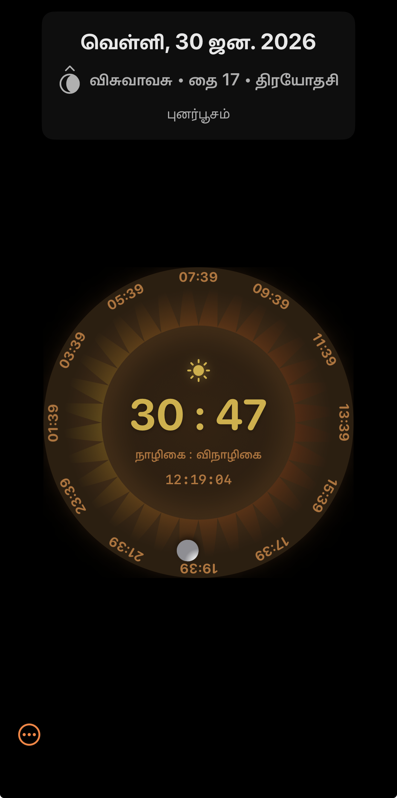

# Kadigaram

A Vedic Time and Calendar App for iOS.

---

## (Ancient) Indian Standard Time

### The 60-Hour Vedic Clock

The ancient Indian time system divides the day into **60 equal parts** from one sunrise to the next, unlike the modern 24-hour system. Each of these 60 parts is called a **Nazhigai** (Tamil) or **Ghatika** (Sanskrit).

| Unit | Sanskrit | Tamil | Duration |
|------|----------|-------|----------|
| 1 Nazhigai/Ghatika | **घटिका** (Ghaṭikā) | **நாழிகை** (Nāḻikai) | 24 minutes |
| 1 Vinazhigai/Vighatika | **विघटिका** (Vighaṭikā) | **விநாழிகை** (Vināḻikai) | 24 seconds |

### How It Works

- **The clock starts at sunrise** and counts up through 60 Nazhigai
- **At the next sunrise**, the clock resets to 0:0 and begins again
- **Day and Night** each have approximately 30 Nazhigai (though this varies by season)
- **Time is location-dependent** - sunrise varies by geographic position

### Time Units Explained

**Sanskrit (संस्कृत):**
- *Ghaṭikā* (घटिका) = 1/60th of a day ≈ 24 minutes
- *Vighaṭikā* (विघटिका) = 1/60th of a Ghaṭikā ≈ 24 seconds
- *Prāṇa* (प्राण) = 4 seconds (breath cycle)

**Tamil (தமிழ்):**
- *Nāḻikai* (நாழிகை) = 1/60th of a day ≈ 24 minutes
- *Vināḻikai* (விநாழிகை) = 1/60th of a Nāḻikai ≈ 24 seconds

### Example

If sunrise is at **6:30 AM** and the current time is **10:30 AM**:
- Modern time since sunrise: 4 hours = 240 minutes
- Vedic time: 240 ÷ 24 = **10 Nazhigai**

---

## கடிகாரம் (Kadigaram)

### Meaning & Origin

**கடிகாரம்** (Kaḍikāram) is the Tamil word for "clock" or "timepiece."

| Script | Word | Pronunciation |
|--------|------|---------------|
| Tamil | கடிகாரம் | Ka-ḍi-kā-ram |
| IPA | /kəɖɪɡaːɾəm/ | kuh-di-GAA-rum |

**Etymology:**
- Derived from Sanskrit **घटिका** (*Ghaṭikā*) meaning "water pot" or "time unit"
- Ancient water clocks used pots with holes to measure Ghaṭikā
- The word evolved into Tamil as *Kaḍikāram* to mean any timepiece

**Historical Context:**
Water clocks (*Jala Yantra*) in ancient India used a copper bowl with a small hole. When floated in water, it would sink in exactly one Ghaṭikā (24 minutes), marking time divisions throughout the day.

---

## Features

- 🕐 **60-Hour Solar Clock** — Ancient Indian time system with modern UI, counting Nazhigai from sunrise
- ⏰ **Vedic Alarms** — Set alarms based on Nazhigai time using Apple's AlarmKit (iOS 26+)
- 🌙 **Moon Phases** — Shows waxing (Shukla Paksha ↑) and waning (Krishna Paksha ↓) moon phases
- 📍 **Location-Based Sunrise** — Supports both GPS and manual location entry for accurate sunrise calculation
- 📅 **Indian Calendar** — Displays Tithi (lunar day), Tamil Month, Date, and Star (Nakshatra)
- 🌐 **Multi-Language** — Supports Tamil (தமிழ்) and English
  - *Coming Soon: Sanskrit (संस्कृत), Telugu (తెలుగు), Malayalam (മലയാളം), Kannada (ಕನ್ನಡ)*
- 📱 **Home Screen Widget** — Live Vedic time widget with moon phase and date
- 🎨 **Theming** — Light and Dark mode with traditional color palettes

---

## Architecture

| Module | Description |
|--------|-------------|
| **Kadigaram** | Main iOS App (SwiftUI) |
| **KadigaramWidget** | Home Screen Widget Extension |
| **KadigaramCore** | Shared UI components and models |
| **SixPartsLib** | Core astronomical calculation engine |

---

## Requirements

- iOS 17.0+ (iOS 26+ for AlarmKit features)
- Xcode 16.0+
- Swift 6.0+

---

## License

[Add your license here]

---

*"Time is the wisest counselor of all."* — Pericles
