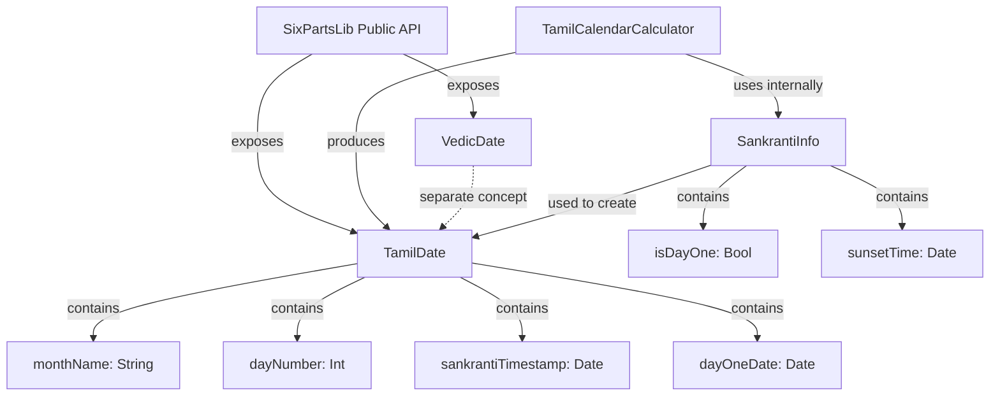

# Data Model: Accurate Tamil Date Calculation

**Feature**: 005-accurate-tamil-date  
**Created**: 2026-01-19

## Core Entities

### TamilDate

Represents a Tamil calendar date with month and day number.

```swift
public struct TamilDate {
    /// Tamil month name (localization key, e.g., "month_thai", "month_chithirai")
    public let monthName: String
    
    /// Day of Tamil month (1-32, depending on month length)
    public let dayNumber: Int
    
    /// Exact timestamp when Sun entered current Rasi (Sankranti moment)
    public let sankrantiTimestamp: Date
    
    /// Date determined as Day 1 of this Tamil month (after applying sunset rule)
    public let dayOneDate: Date
    
    /// Rasi (zodiac sign) degree boundary for this month (0, 30, 60, ..., 330)
    public let rasiDegree: Double
}
```

**Validation Rules**:
- `dayNumber`: Must be >= 1 and <= 32
- `monthName`: Must be one of 12 valid Tamil month localization keys
- `rasiDegree`: Must be one of {0, 30, 60, 90, 120, 150, 180, 210, 240, 270, 300, 330}
- `dayOneDate`: Must be <= current date (cannot be in future)

**Usage**: Returned by `TamilCalendarCalculator.calculateTamilDate()`

---

### SankrantiInfo

Internal structure for tracking Sankranti calculation details.

```swift
internal struct SankrantiInfo {
    /// Target Rasi boundary degree (0-360)
    let rasiDegree: Double
    
    /// Exact timestamp when Sun crossed the boundary
    let sankrantiTime: Date
    
    /// Sunset time on Sankranti date for given location
    let sunsetTime: Date
    
    /// True if Sankranti occurred before sunset (making that day "Day 1")
    let isDayOne: Bool
    
    /// Day 1 date after applying sunset rule
    let dayOneDate: Date
}
```

**Purpose**: Used during Tamil date calculation to track intermediate results. Not exposed in public API.

---

### VedicDate (Modified)

**MOVED FROM**: `KadigaramCore/Sources/KadigaramCore/Models/VedicDate.swift`  
**TO**: `SixPartsLib/Sources/SixPartsLib/Models/VedicDate.swift`

**Changes**: None (structure remains the same, just relocated)

```swift
public struct VedicDate {
    public let samvatsara: String          // Year name (localization key)
    public let samvatsaraIndex: Int        // Position in 60-year cycle (1-60)
    public let maasa: String               // Month name (localization key)
    public let paksha: Paksha              // Fortnight (Shukla/Krishna)
    public let pakshamIllumination: Double // Moon phase (0.0-1.0)
    public let tithi: String               // Lunar day (localization key)
    public let tithiProgress: Double       // Tithi completion (0.0-1.0)
    public let tithiNumber: Int            // Tithi number (1-30)
    public let nakshatra: String           // Lunar mansion (localization key)
    public let nakshatraProgress: Double   // Nakshatra completion (0.0-1.0)
    public let nakshatraNumber: Int        // Nakshatra number (1-27)
    public let day: Int                    // Day of month (Gregorian or Tamil context)
}
```

---

## Enumerations

### CalendarSystem (Existing)

**No changes** — already defined in `KadigaramCore`

```swift
public enum CalendarSystem {
    case solar   // Tamil solar calendar
    case lunar   // North Indian lunar calendar
}
```

### Paksha (Existing)

**No changes** — already defined in `KadigaramCore`

```swift
public enum Paksha {
    case shukla   // Bright fortnight (waxing moon)
    case krishna  // Dark fortnight (waning moon)
}
```

---

## Relationships



**Notes**:
- `TamilDate` and `VedicDate` are independent — they represent different calendar systems
- `SankrantiInfo` is an internal implementation detail, never exposed to app developers
- Both date types are value types (structs) for immutability and thread safety

---

## State Transitions

### Tamil Date Calculation Flow

```
User provides: (currentDate, location, timeZone)
                    ↓
1. Calculate Sun's sidereal longitude → determine current month
                    ↓
2. Find Sankranti timestamp (binary search)
                    ↓
3. Get sunset time on Sankranti date → apply sunset rule
                    ↓
4. Determine Day 1 date (either Sankranti day or day after)
                    ↓
5. Calculate day number: (currentDate - dayOneDate) + 1
                    ↓
        Return TamilDate struct
```

**Immutable**: All structs are immutable — no state changes after creation.

---

## Storage Considerations

**No persistence required** — all calculations are ephemeral:
- Calculations performed on-demand when user opens app
- Results discarded after display
- No caching needed (calculations complete in <50ms)

**Rationale**: Tamil date changes at most once per month (Sankranti moment), and app usage is typically brief (check time, close app). Caching adds complexity with minimal performance benefit.

---

## Summary

**New Entities**:
- `TamilDate` (public struct)
- `SankrantiInfo` (internal struct)

**Relocated Entities**:
- `VedicDate` (moved to SixPartsLib, no changes)

**Unchanged Entities**:
- `CalendarSystem` enum
- `Paksha` enum

All entities follow Swift value type best practices (structs, immutability, no optionals where possible).
